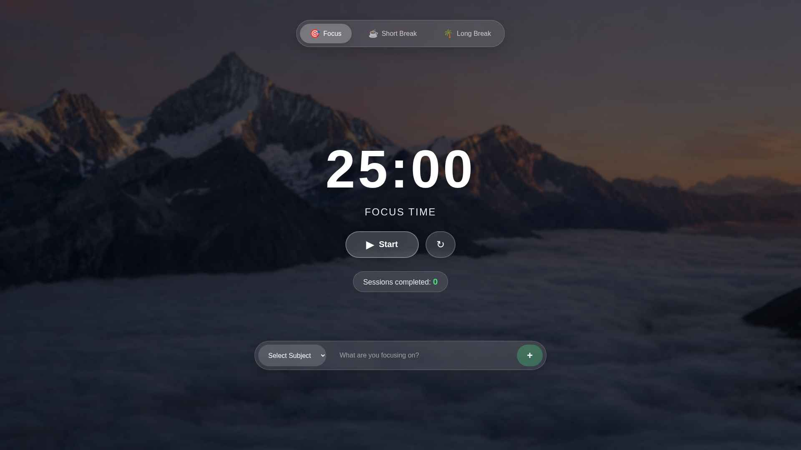
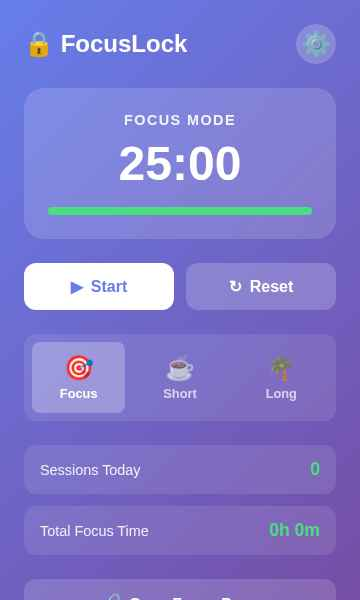

# 🔒 FocusLock - Pomodoro Chrome Extension

A powerful Chrome extension that combines the Pomodoro technique with strict focus mode to help you stay productive and focused.

## ✨ Features

### 🎯 Pomodoro Timer
- Customizable focus sessions (default: 25 minutes)
- Short breaks (default: 5 minutes)
- Long breaks (default: 15 minutes)
- Automatic session tracking
- Visual progress indicators

### 🔒 Strict Focus Mode
- **Block distracting websites** during focus sessions
- **Prevent tab switching** to maintain focus
- **Block new tab creation** during work time
- **Full-screen focus page** with beautiful mountain background
- Automatic unlock when session ends

### 🎨 Beautiful UI
- Glassmorphism design with stunning mountain backdrop
- Real-time countdown display
- Task management with subject categories
- Visual task cards with completion tracking
- Responsive design

### 📝 Task Management
- Create tasks with subject categories (Work, Study, Exercise, etc.)
- Track task completion
- Persistent task storage
- Beautiful glassmorphism task cards

### 🔔 Notifications
- Browser notifications when sessions complete
- Sound alerts (can be toggled)
- Visual warnings for blocked sites

### ⚙️ Customizable Settings
- Adjust all timer durations
- Configure auto-start behavior
- Manage blacklist and whitelist
- Toggle strict mode
- Enable/disable notifications and sounds

## 📸 Screenshots

### Home Screen


### Setup Screen


## 🚀 Installation

### Method 1: Load as Unpacked Extension (Development)

1. Open Chrome and navigate to `chrome://extensions/`
2. Enable "Developer mode" (toggle in top-right corner)
3. Click "Load unpacked"
4. Select the `/app` folder containing the extension files
5. The FocusLock extension should now appear in your extensions list

### Method 2: Pack and Install

1. In Chrome, go to `chrome://extensions/`
2. Enable "Developer mode"
3. Click "Pack extension"
4. Select the `/app` folder as the extension root directory
5. Click "Pack Extension"
6. Install the generated `.crx` file

## 📖 Usage

### Starting a Focus Session

1. Click the FocusLock icon in your Chrome toolbar
2. Adjust the mode (Focus/Short Break/Long Break) if needed
3. Click "Start" to begin the timer
4. During focus mode, distracting sites will be blocked automatically

### Managing Tasks

1. Open the focus page (full-screen view)
2. Select a subject category from the dropdown
3. Enter your task in the input field
4. Click "+" to add the task
5. Mark tasks as complete or delete them as needed

### Configuring Settings

1. Click the FocusLock icon
2. Click the settings gear (⚙️) icon
3. Adjust timer durations, enable/disable features
4. Add sites to blacklist (to block) or whitelist (to allow)
5. Click "Save Settings"

### Blacklist & Whitelist

**Blacklist**: Sites that will be blocked during focus sessions
- Default includes: Facebook, Twitter, Instagram, YouTube, Reddit, TikTok, Netflix, Twitch, Discord, Snapchat
- Add your own distracting sites

**Whitelist**: Sites that are always accessible
- Add study resources, work tools, or necessary websites
- Whitelist overrides blacklist

## 🎨 Design Features

- **Mountain Background**: Serene mountain landscape with clouds for a calming focus environment
- **Glassmorphism UI**: Modern frosted glass effect on all UI elements
- **Dark Overlay**: Ensures text readability over the background
- **Smooth Animations**: Polished transitions and interactions
- **Responsive Layout**: Works on various screen sizes

## 📁 File Structure

```
/app/
├── manifest.json          # Extension configuration (Manifest V3)
├── background.js          # Service worker for timer and blocking logic
├── focus.html            # Full-screen focus page
├── focus.js              # Focus page logic
├── focus.css             # Focus page styles
├── popup.html            # Extension popup
├── popup.js              # Popup logic
├── popup.css             # Popup styles
├── options.html          # Settings page
├── options.js            # Settings logic
├── options.css           # Settings styles
├── content.js            # Content script for site blocking
├── utils.js              # Shared utilities
├── assets/
│   └── mountain-bg.jpg   # Mountain background image
└── icons/
    ├── icon-16.png       # 16x16 icon
    ├── icon-48.png       # 48x48 icon
    └── icon-128.png      # 128x128 icon
```

## 🔧 Technical Details

- **Manifest Version**: V3 (latest Chrome extension standard)
- **Permissions**: storage, tabs, notifications, alarms, webNavigation
- **Storage**: chrome.storage.sync for settings, chrome.storage.local for timer state
- **Background**: Service worker for timer management
- **Content Scripts**: Injected into all pages for blocking logic

## 🎯 Keyboard Shortcuts

- **Enter**: Add task (when focused on task input)
- **Escape**: Close warning overlays

## 📊 Statistics Tracking

- Sessions completed today
- Total focus time accumulated
- Progress indicators for current session

## 🛡️ Privacy

- All data stored locally in Chrome storage
- No external servers or data transmission
- No tracking or analytics
- Your tasks and settings never leave your browser

## 🐛 Troubleshooting

### Timer not starting
- Check if extension has proper permissions
- Reload the extension in chrome://extensions/

### Sites not being blocked
- Ensure "Strict Mode" is enabled in settings
- Verify sites are in the blacklist
- Check that the site isn't in the whitelist

### Focus page not loading
- Check that mountain-bg.jpg exists in assets folder
- Verify extension is properly installed

## 🔄 Future Enhancements

- Statistics dashboard
- Export/import settings
- Custom background images
- Multiple timer presets
- Desktop notifications improvements
- Sync across devices

## 📝 License

This extension is for personal and educational use.


Made with 💛 Lunar Vibes
---

**Stay focused. Stay productive. Stay locked in. 🔒**
